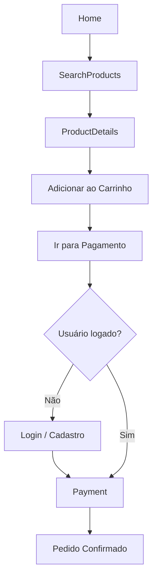

# Front-end Móvel
Este repositório contém o desenvolvimento da interface mobile da aplicação, construída utilizando React Native com o auxílio do Expo. O objetivo desta etapa é entregar a base do aplicativo móvel, garantindo um ambiente estruturado, organizado e funcional para a evolução do projeto nas próximas fases. O foco é estabelecer uma interface inicial consistente, padronizada e alinhada às boas práticas de desenvolvimento mobile.

## Projeto da Interface
A interface mobile foi projetada seguindo o kit de marca oficial da TeraBum, priorizando:
- Identidade visual consistente
- Experiência de uso intuitiva
- Componentização limpa e reutilizável
- Navegação fluida

O desenvolvimento faz uso de React Native Paper para acelerar a criação da interface com padrões sólidos de design. Os testes e execução são realizados com Expo Go.

### Wireframes
Os wireframes representam a organização inicial das telas e os principais elementos de interface, servindo como referência para o desenvolvimento visual e para o fluxo de navegação do usuário.

<table>
  <tr>
    <td align="center">
      <strong>Home</strong><br>
      
    </td>
    <td align="center">
      <strong>SearchProducts</strong><br>
      
    </td>
    <td align="center">
      <strong>ProductDetails</strong><br>
      
    </td>
    <td align="center">
      <strong>Register</strong><br>
      
    </td>
    <td align="center">
      <strong>Login</strong><br>
      
    </td>
  </tr>

  <tr>
    <td align="center">
      <strong>Profile</strong><br>
      
    </td>
    <td align="center">
      <strong>Stock</strong><br>
      
    </td>
    <td align="center">
      <strong>Cart</strong><br>
      
    </td>
    <td align="center">
      <strong>Payment</strong><br>
      
    </td>
    <td align="center">
      <strong>PaymentConfirm</strong><br>
      
    </td>
  </tr>
</table>

### Design Visual
O design tem como referência o Kit de Marca TeraBum:
 

## Fluxo de Dados
O app permite navegação completa sem login. Ao abrir, verifica se há token salvo; se existir, o usuário já entra autenticado, caso contrário continua como visitante. A navegação sempre começa na Home, onde ele pode ver produtos, buscar itens e acessar o carrinho. O usuário pode adicionar produtos normalmente ao carrinho e visualizar detalhes sem precisar fazer login. A autenticação só é exigida quando ele tenta Finalizar a Compra. Nesse momento, ele é direcionado ao Login ou Cadastro. Após autenticar, retorna automaticamente ao Checkout. Com login ativo, ele prossegue para a tela de Pagamento e, ao concluir, vê a tela de Confirmação, podendo voltar à Home.




## Tecnologias Utilizadas
- React Native
- Expo / Expo CLI / Expo Go
- TypeScript
- React Native Paper
- GitHub (fluxo com forks, Conventional Commits, pull requests e code review)

## Considerações de Segurança
- Camada mobile preparada para futura autenticação segura
- Manuseio cuidadoso de estados sensíveis
- Fluxo de versionamento estruturado para evitar inconsistências
- Adoção de padrões que reduzem vulnerabilidades ao integrar com APIs

## Implantação
Esta seção descreve como implantar os serviços backend da aplicação em um ambiente de produção.

###  1. Requisitos de Hardware e Software
- Servidor ou ambiente em nuvem com suporte a Docker e Docker Compose (ex.: AWS, Azure, Render, DigitalOcean).
- Banco de dados PostgreSQL (pode ser gerenciado, como Supabase ou RDS).
- Node.js 18+ instalado (caso o deploy não utilize Docker).
- Variáveis de ambiente configuradas (.env).

###  2. Plataforma de Hospedagem
Recomendações adequadas para o backend:
- Render, Railway, Fly.io, Azure Web App, AWS ECS ou DigitalOcean Droplets.

Essas plataformas suportam contêineres e oferecem gerenciadores de variáveis de ambiente. 

O aplicativo móvel não é implantado via Docker.Ele é distribuído via Expo, Google Play ou APK, não por servidor.

###  3. Configuração do Ambiente
- Configure variáveis de ambiente (exemplo):
```
DATABASE_URL=postgres://...
JWT_SECRET=...
SUPABASE_KEY=...
```

- Instale dependências:
```
npm install
```
- Caso utilize Docker:
```
docker compose up -d --build
```
###  4. Deploy da Aplicação
Siga o procedimento da plataforma escolhida:
- Com Docker: enviar Dockerfile / compose para o provedor.
- Sem Docker: subir código para um servidor Node, instalar dependências e rodar:
```
npm run start
```
Para o mobile, o deploy é feito via Expo:
```npx expo build:android
npx expo build:ios
```
###  5. Testes Pós-Deploy
Após a implantação:
- Validar se o backend responde aos endpoints (/health, /api/v1/...).
- Testar integração com banco de dados.
- Testar fluxo completo no app Expo conectado ao backend de produção.
- Monitorar logs e erros do servidor.

## Testes

**Caso de Teste 1 – Funcionalidade administrativa de estoque e produtos**

**Objetivo:**  
Garantir que a funcionalidade de crud de estoque e de produto funciona e está protegida por autenticação.

| Item | Descrição |
|------|------------|
| **Tipo de teste** | Funcional / Integração |
| **Pré-condições** | Login com role de "Administrador" |
| **Passos** | 1. Acessar a página de usuário.<br>2. Realizar operações de crud de item de estoque.<br>3. Realizar operações de crud de produto.<br> |
| **Resultado Esperado** | Criação, edição e exclusão de itens de estoque e produtos após login bem sucedido. |

### Evidência:

Acessar tela de usuário e a página de administração de estoque e produtos:


- Crud de item de estoque:

Criação:


Atualização:


Baixa de estoque:


- Crud de produto:

Criação:


Atualização:


#### **Caso de Teste — Busca de Produto na Home**

**Objetivo:**
Verificar se a busca funciona corretamente na Home.

**Passos:**
Abrir o aplicativo e acessar a Home.
Tocar na barra de busca.
Digitar “notebook” e confirmar a busca.

**Resultado Esperado:**
A lista deve exibir apenas produtos relacionados ao termo “notebook”.

#### **Caso de Teste — Filtro por Categoria**

**Objetivo:**
Validar se o filtro de categoria funciona corretamente.

**Passos:**
Estar na Home.
Tocar na categoria “Hardware”.

**Resultado Esperado:**
O aplicativo deve abrir a tela de produtos mostrando somente itens da categoria selecionada.

#### **Caso de Teste — Ordenação e Filtro de Preço**

**Objetivo:**
Garantir que a ordenação e o filtro de preço funcionem adequadamente.

**Passos:**
Acessar a tela de Produtos.
Selecionar a ordenação “Menor preço”.
Definir o filtro de preço máximo em R$ 1000.

**Resultado Esperado:**
A lista deve mostrar apenas produtos com valor até R$ 1000, ordenados do menor para o maior preço.

# Referências

Inclua todas as referências (livros, artigos, sites, etc) utilizados no desenvolvimento do trabalho.

# Planejamento

##  Quadro de tarefas

> Apresente a divisão de tarefas entre os membros do grupo e o acompanhamento da execução, conforme o exemplo abaixo.

### Semana 1

Atualizado em: 14/11/2025

| Responsável   | Tarefa/Requisito | Iniciado em    | Prazo      | Status | Terminado em    |
| :----         |    :----         |      :----:    | :----:     | :----: | :----:          |
| Daniela Assis        | Atualização Documentação e Base Projeto Mobile | 10/11/2025     | 14/11/2025 | ✔️    | 14/11/2025      |
| Tales Hein        | Desenvolver pagina admin no mobile   | 20/11/2025     | 30/11/2025 |  ✔️   | 30/11/2025 |
| AlunoY        | Histórias de usuário  | 01/01/2024     | 07/01/2005 | ⌛     |                 |
| AlunoK        | Personas 1  |    01/01/2024        | 12/02/2005 | ❌    |       |

#### Semana 2

Atualizado em: 21/04/2024

| Responsável   | Tarefa/Requisito | Iniciado em    | Prazo      | Status | Terminado em    |
| :----         |    :----         |      :----:    | :----:     | :----: | :----:          |
| Daniela Assis | Fluxo de Dadas, Wireframes, e páginas Home, SearchProducts e ProductDetails | 17/11/2025 | 01/12/2025 | ✔️ | 01/12/2025      |
|  Daniela Assis | Implantação (documentação) e Testes da API vitrineService no mobile | 01/12/2025 | 01/12/2025 | ✔️     |   05/12/2025  |
| AlunaZ        | CSS unificado    | 03/02/2024     | 10/03/2024 | 📝    |                 |
| AlunoY        | Página de login  | 01/02/2024     | 07/03/2024 | ⌛     |                 |
| AlunoK        | Script de login  |  01/01/2024    | 12/03/2024 | ❌    |       |

Legenda:
- ✔️: terminado
- 📝: em execução
- ⌛: atrasado
- ❌: não iniciado

