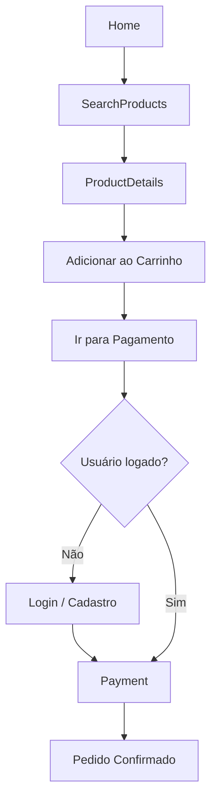

# Front-end Móvel
Este repositório contém o desenvolvimento da interface mobile da aplicação, construída utilizando React Native com o auxílio do Expo. O objetivo desta etapa é entregar a base do aplicativo móvel, garantindo um ambiente estruturado, organizado e funcional para a evolução do projeto nas próximas fases. O foco é estabelecer uma interface inicial consistente, padronizada e alinhada às boas práticas de desenvolvimento mobile.

## Projeto da Interface
A interface mobile foi projetada seguindo o kit de marca oficial da TeraBum, priorizando:
- Identidade visual consistente
- Experiência de uso intuitiva
- Componentização limpa e reutilizável
- Navegação fluida

O desenvolvimento faz uso de React Native Paper para acelerar a criação da interface com padrões sólidos de design. Os testes e execução são realizados com Expo Go.

### Wireframes
Os wireframes representam a organização inicial das telas e os principais elementos de interface, servindo como referência para o desenvolvimento visual e para o fluxo de navegação do usuário.

##### Homepage

##### Pesquisar Produtos

##### Detalhes Produtos 

##### Registrar

##### Login

##### Estoque

##### Carrinho

##### Pagamento

##### Confirmação de Pagamento

### Design Visual
O design tem como referência o Kit de Marca TeraBum:

## Fluxo de Dados
O app permite navegação completa sem login. Ao abrir, verifica se há token salvo; se existir, o usuário já entra autenticado, caso contrário continua como visitante. A navegação sempre começa na Home, onde ele pode ver produtos, buscar itens e acessar o carrinho. O usuário pode adicionar produtos normalmente ao carrinho e visualizar detalhes sem precisar fazer login. A autenticação só é exigida quando ele tenta Finalizar a Compra. Nesse momento, ele é direcionado ao Login ou Cadastro. Após autenticar, retorna automaticamente ao Checkout. Com login ativo, ele prossegue para a tela de Pagamento e, ao concluir, vê a tela de Confirmação, podendo voltar à Home.

## Tecnologias Utilizadas
- React Native
- Expo / Expo CLI / Expo Go
- TypeScript
- React Native Paper
- GitHub (fluxo com forks, Conventional Commits, pull requests e code review)

## Considerações de Segurança
- Camada mobile preparada para futura autenticação segura
- Manuseio cuidadoso de estados sensíveis
- Fluxo de versionamento estruturado para evitar inconsistências
- Adoção de padrões que reduzem vulnerabilidades ao integrar com APIs

## Implantação

[Instruções para implantar a aplicação distribuída em um ambiente de produção.]

1. Defina os requisitos de hardware e software necessários para implantar a aplicação em um ambiente de produção.
2. Escolha uma plataforma de hospedagem adequada, como um provedor de nuvem ou um servidor dedicado.
3. Configure o ambiente de implantação, incluindo a instalação de dependências e configuração de variáveis de ambiente.
4. Faça o deploy da aplicação no ambiente escolhido, seguindo as instruções específicas da plataforma de hospedagem.
5. Realize testes para garantir que a aplicação esteja funcionando corretamente no ambiente de produção.

## Testes

**Caso de Teste 1 – Funcionalidade administrativa de estoque e produtos**

**Objetivo:**  
Garantir que a funcionalidade de crud de estoque e de produto funciona e está protegida por autenticação.

| Item | Descrição |
|------|------------|
| **Tipo de teste** | Funcional / Integração |
| **Pré-condições** | Login com role de "Administrador" |
| **Passos** | 1. Acessar a página de usuário. 2. Realizar operações de crud de item de estoque. 3. Realizar operações de crud de produto.  |
| **Resultado Esperado** | Criação, edição e exclusão de itens de estoque e produtos após login bem sucedido. |

Evidência:

Acessar tela de usuário e a página de administração de estoque e produtos:

Crud de item de estoque:

Criação:

Atualização:

Baixa de estoque:

# Referências

Inclua todas as referências (livros, artigos, sites, etc) utilizados no desenvolvimento do trabalho.

# Planejamento

##  Quadro de tarefas

> Apresente a divisão de tarefas entre os membros do grupo e o acompanhamento da execução, conforme o exemplo abaixo.

### Semana 1

Atualizado em: 14/11/2025

| Responsável   | Tarefa/Requisito | Iniciado em    | Prazo      | Status | Terminado em    |
| :----         |    :----         |      :----:    | :----:     | :----: | :----:          |
| Daniela Assis        | Atualização Documentação e Base Projeto Mobile | 10/11/2025     | 14/11/2025 | ✔️    | 14/11/2025      |
| AlunaZ        | Objetivos    | 03/02/2024     | 10/02/2024 | 📝    |                 |
| AlunoY        | Histórias de usuário  | 01/01/2024     | 07/01/2005 | ⌛     |                 |
| AlunoK        | Personas 1  |    01/01/2024        | 12/02/2005 | ❌    |       |

#### Semana 2

Atualizado em: 21/04/2024

| Responsável   | Tarefa/Requisito | Iniciado em    | Prazo      | Status | Terminado em    |
| :----         |    :----         |      :----:    | :----:     | :----: | :----:          |
| Daniela Assis | Fluxo de Dadas, Wireframes, Testes da API vitrineService no mobile e páginas Home, SearchProducts e ProductDetails | 17/11/2025 | 01/12/2025 | ✔️ | 30/11/2025      |
| AlunaZ        | CSS unificado    | 03/02/2024     | 10/03/2024 | 📝    |                 |
| AlunoY        | Página de login  | 01/02/2024     | 07/03/2024 | ⌛     |                 |
| AlunoK        | Script de login  |  01/01/2024    | 12/03/2024 | ❌    |       |

Legenda:
- ✔️: terminado
- 📝: em execução
- ⌛: atrasado
- ❌: não iniciado

